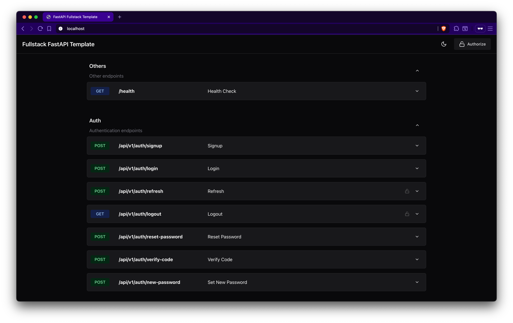
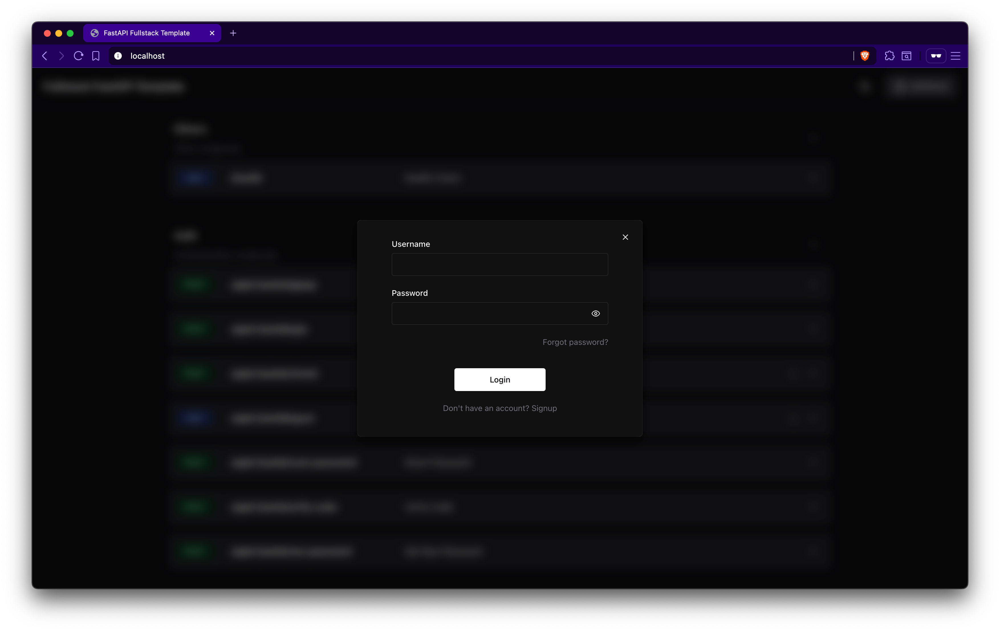
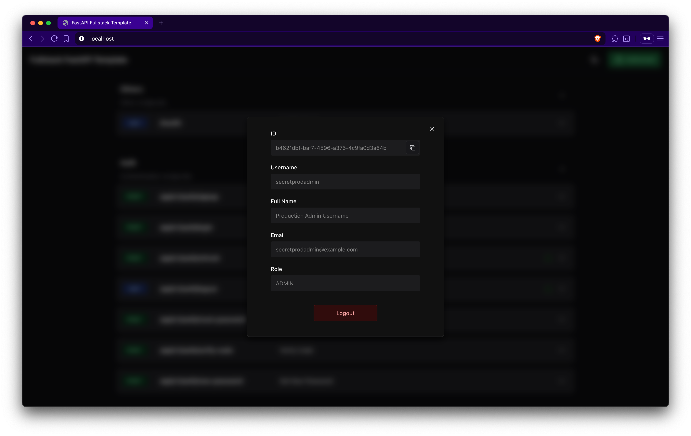
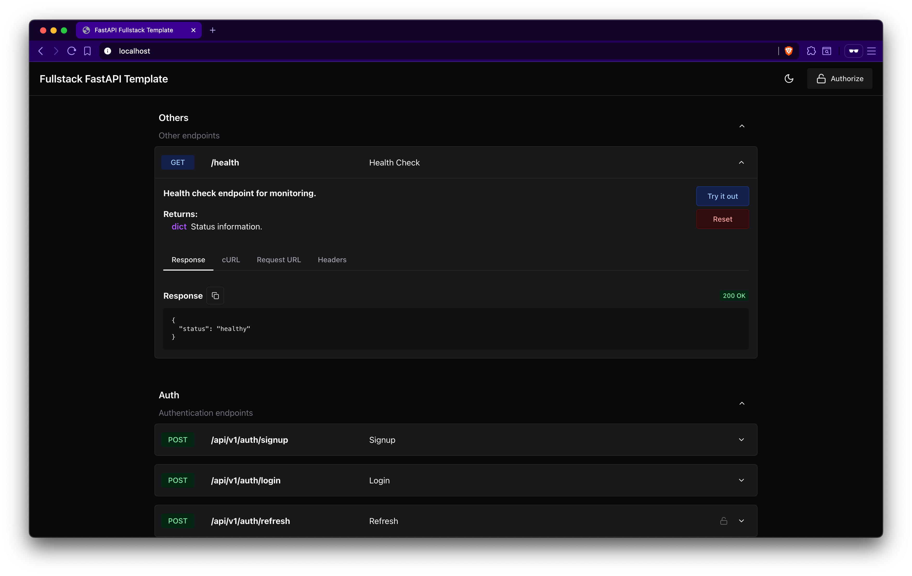
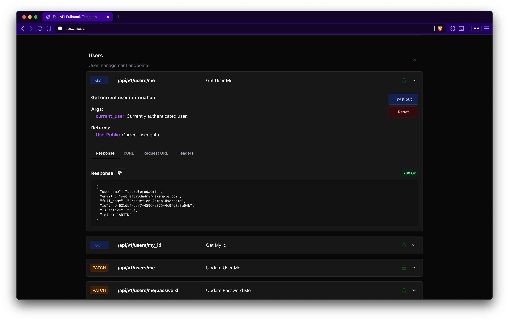

# 🚀 Fullstack Template FastAPI + React Typescript

> **Production-ready full-stack template with enterprise-grade features, comprehensive monitoring, and modern development practices.**

[](https://github.com/lulzseq/fullstack-fastapi-react/actions/workflows/backend.yml)
[](https://github.com/lulzseq/fullstack-fastapi-react/actions/workflows/frontend.yml)
[](https://codecov.io/gh/lulzseq/fullstack-fastapi-react)


- 🏗️ **Enterprise Architecture** - Clean architecture with proper separation of concerns
- 🔒 **Security First** - JWT authentication, rate limiting, CORS, security headers
- 📊 **Full Observability** - Prometheus metrics, Grafana dashboards, structured logging
- 🧪 **Testing Excellence** - Unit, integration, performance, and load testing
- 🚀 **DevOps Ready** - Docker, CI/CD, automated deployments
- 🎨 **Modern Frontend** - React 19, TypeScript, Chakra UI, Redux Toolkit

### Homepage

[](https://github.com/lulzseq/fullstack-fastapi-react)

### Authentication

[](https://github.com/lulzseq/fullstack-fastapi-react)

### User Info

[](https://github.com/lulzseq/fullstack-fastapi-react)

### Healthcheck

[](https://github.com/lulzseq/fullstack-fastapi-react)

### Calling an API Endpoint

[](https://github.com/lulzseq/fullstack-fastapi-react)

## 🛠️ Technology Stack

### Backend (Python 3.13+)
- ⚡ **[FastAPI](https://fastapi.tiangolo.com)** - High-performance async API framework
- 🗄️ **[SQLAlchemy](https://sqlalchemy.org)** + **[Alembic](https://alembic.sqlalchemy.org)** - Advanced ORM with migrations
- 🔍 **[Pydantic](https://docs.pydantic.dev)** - Data validation and settings management
- 💾 **[PostgreSQL](https://postgresql.org)** - Robust relational database
- 🚀 **[Redis](https://redis.io)** - High-performance caching and sessions
- 🐰 **[RabbitMQ](https://rabbitmq.com)** - Message queue for async processing
- 📧 **Email Integration** - Password reset and notifications
- 🔐 **JWT Authentication** - Secure token-based auth with refresh tokens

### Frontend (React 19)
- ⚛️ **[React 19](https://react.dev)** - Latest React with modern features
- 📘 **[TypeScript](https://typescriptlang.org)** - Type-safe development
- 🎨 **[Chakra UI](https://chakra-ui.com)** - Beautiful, accessible components
- 🔄 **[Redux Toolkit](https://redux-toolkit.js.org)** - Predictable state management
- 🌐 **[React Router](https://reactrouter.com)** - Client-side routing
- 📱 **[React Hook Form](https://react-hook-form.com)** - Performance forms
- ⚡ **[Vite](https://vitejs.dev)** - Lightning-fast build tool
- 🌙 **Dark Mode** - Built-in theme switching

### DevOps & Monitoring
- 🐋 **[Docker](https://docker.com)** + **Docker Compose** - Containerized deployment
- 📊 **[Prometheus](https://prometheus.io)** - Metrics collection and alerting
- 📈 **[Grafana](https://grafana.com)** - Monitoring dashboards
- 📝 **[Loki](https://grafana.com/oss/loki)** + **[Promtail](https://grafana.com/docs/loki/latest/send-data/promtail)** - Centralized logging
- 🔧 **[GitHub Actions](https://github.com/features/actions)** - CI/CD pipelines
- 🧪 **[Pytest](https://pytest.org)** - Comprehensive testing suite
- 🎭 **[Playwright](https://playwright.dev)** - E2E testing
- 🏋️ **[Locust](https://locust.io)** - Load testing and performance monitoring

## 🚀 Quick Start

### Prerequisites
- **Python 3.13+** and **uv** package manager
- **Node.js 18+** and **npm**
- **Docker** and **Docker Compose**

### 1. Clone and Setup
```bash
git clone https://github.com/lulzseq/fullstack-fastapi-react.git
cd fullstack-fastapi-react
```

### 2. Configure Environment
Edit `.env` file with your settings:
```bash
# Security
SECRET_KEY=your-super-secret-key-here
FIRST_SUPERUSER_PASSWORD=your-admin-password

# Database
POSTGRES_PASSWORD=your-db-password

# Email (optional)
SMTP_HOST=smtp.domain.com
SMTP_USER=your-email@domain.com
SMTP_PASSWORD=your-app-password
...
```

### 3. Launch with Docker
```bash
# Start all services locally with docker-compose.override.yml
docker compose up -d --build

# Or start production mode with docker-compose.yml
docker compose -f docker-compose.yml up -d --build

# Check status
docker compose ps
```

### 4. Access Your Application
- **Frontend**: http://localhost
- **API Documentation**: http://localhost/api/v1/docs
- **Grafana Dashboard**: http://localhost:3000 (default admin/admin)
- **Prometheus**: http://localhost:9090
- **RabbitMQ Management**: http://localhost:15672 (default guest/guest)
- **PgAdmin**: http://localhost:5050

## 🏗️ Architecture Highlights

### Clean Architecture
```
backend/
├── app/
│   ├── api/           # API endpoints and routing
│   ├── core/          # Configuration and core functionality
│   ├── models/        # Domain models and schemas
│   ├── repositories/  # Data access layer
│   ├── services/      # Business logic layer
│   ├── utils/         # Utility functions
│   └── validators/    # Input validation
```

### Advanced Features

#### 🔒 **Security**
- JWT tokens with automatic refresh
- Rate limiting with Redis
- CORS configuration
- Security headers middleware
- Password hashing with bcrypt
- Input validation and sanitization

#### 📊 **Monitoring & Observability**
- **Metrics**: Custom Prometheus metrics for API performance
- **Logging**: Structured JSON logging with request tracing
- **Dashboards**: Pre-configured Grafana dashboards
- **Health Checks**: Comprehensive health monitoring
- **Performance Profiling**: Built-in profiler for optimization

#### 🧪 **Testing Strategy**
- **Unit Tests**: 95%+ code coverage
- **Integration Tests**: Database and API testing
- **Performance Tests**: Benchmarking and memory profiling
- **Load Tests**: Locust-based stress testing
- **E2E Tests**: Playwright browser automation

#### 🚀 **Performance**
- **Async/Await**: Non-blocking I/O operations
- **Connection Pooling**: Optimized database connections
- **Caching**: Redis-based response caching
- **Compression**: Gzip response compression
- **CDN Ready**: Static asset optimization

## 📱 Frontend Features

### Modern React Development
- **API Explorer**: Interactive endpoint testing interface
- **Authentication Flow**: Complete login/register/reset password
- **Token Refresh**: Autoupdate refresh and access tokens
- **User Management**: Profile management and admin features
- **Responsive Design**: Mobile-first approach
- **Error Handling**: Comprehensive error boundaries
- **Loading States**: Skeleton screens and spinners

### Developer Experience
- **Hot Reload**: Instant development feedback
- **TypeScript**: Full type safety
- **ESLint + Prettier**: Code formatting and linting
- **Bundle Analysis**: Webpack bundle analyzer
- **Performance Monitoring**: Web vitals tracking

## 🔧 Development

### Backend Development
```bash
cd backend

# Install dependencies
uv sync --all-extras --dev

# Database migrations
uv run alembic upgrade head

# Run development server
uv run fastapi dev

# Run tests with xdist
uv run pytest -n auto -v

# Run with coverage
uv run pytest -n auto --cov=. --cov-report=html
```

### Frontend Development
```bash
cd frontend

# Install dependencies
npm install

# Run development server
npm run dev

# Run tests
npm run test

# Build for production
npm run build
```

### Performance Testing
```bash
# Load testing
cd backend/tests/performance/load
locust -f locustfile.py --host=http://localhost:8000

# Memory profiling
cd backend
uv run python -m memory_profiler app/main.py

# Database performance
cd backend/scripts
uv run python analyze_queries.py
```

## 🚢 Deployment

### Production Deployment
```bash
# Build and deploy
docker compose -f docker-compose.yml up -d --build

# Scale services
docker compose up -d --scale backend=3 --scale frontend=2

# Monitor deployment
docker compose logs -f
```

### Environment Configuration
- **Development**: `.env.local`
- **Production**: `.env.production`

## 📊 Monitoring & Metrics

### Key Metrics Tracked
- **API Performance**: Response times, error rates, throughput
- **Database**: Query performance, connection pool usage
- **System**: CPU, memory, disk usage
- **Business**: User registrations, login success rates
- **Security**: Failed authentication attempts, rate limit hits

### Grafana Dashboards
- **Application Overview**: High-level system health
- **API Performance**: Detailed endpoint metrics
- **Database Monitoring**: PostgreSQL performance
- **Infrastructure**: Docker container metrics
- **Business Intelligence**: User activity and growth

## 🧪 Testing

### Test Coverage
- **Unit Tests**: Core business logic and utilities
- **Integration Tests**: Database operations and API endpoints
- **Performance Tests**: Load testing and benchmarking
- **Security Tests**: Authentication and authorization
- **E2E Tests**: Complete user workflows

### Running Tests
```bash
# Backend tests
cd backend
uv run pytest tests/ -v --cov=app

# Frontend tests
cd frontend
npm run test

# E2E tests
npm run test:e2e

# Performance tests
cd backend/tests/performance
uv run python -m pytest benchmark/
```

## 📄 License

This project is licensed under the MIT License - see the [LICENSE](LICENSE) file for details.

---

⭐ **Star this repository if it helped you build something awesome!**